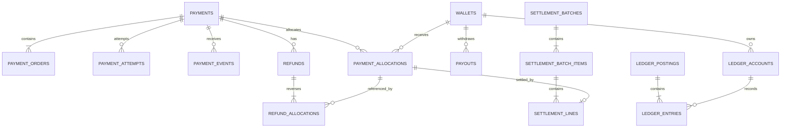

# Database - Payment-Wallet Service

> Service: `payment-wallet-service`  
> Baseline: MySQL 8.4/InnoDB, database `paymentdb`  
> Storage ID: UUIDv7 ở API, lưu database bằng `BINARY(16)`  
> Time: `DATETIME(6)` UTC  
> Money: `BIGINT` integer VND, không dùng `FLOAT`/`DOUBLE`

## 1. Mục tiêu thiết kế

Database của Payment-Wallet Service phải hỗ trợ:

- Một lần checkout có thể gồm nhiều order thuộc nhiều shop.
- VNPAY payment thông qua webhook.
- COD payment được xác nhận khi shipment delivered.
- Payment retry thông qua nhiều payment attempts.
- Payment allocation cho từng shop.
- Seller wallet gồm `pending_balance` và `available_balance`.
- Double-entry ledger.
- Refund theo từng payment allocation.
- Settlement chuyển tiền từ pending sang available.
- Payout cho seller.
- Idempotency cho payment, refund, payout, webhook và Kafka event.
- Transactional outbox.
- Kafka inbox để chống xử lý event trùng.
- Không tạo foreign key sang database của microservice khác.

## 2. Quy ước chung

| Nhóm | Quyết định | Ghi chú |
|---|---|---|
| Money | `BIGINT` | Lưu VND integer, ví dụ `100000` là 100.000 VND |
| Currency | `CHAR(3)` | V1 mặc định `VND` |
| ID nội bộ | `BINARY(16)` | UUIDv7 |
| ID bên ngoài | `BINARY(16)` hoặc `VARCHAR` theo contract | Không FK sang service khác |
| Time | `DATETIME(6)` UTC | API/event dùng ISO-8601 |
| Ledger | Double-entry append-only | Tổng debit bằng tổng credit trên mỗi posting |
| Wallet | Projection từ ledger | Không cập nhật wallet nếu không có ledger posting |
| Secret | Environment/secret manager | Không lưu hoặc log raw secret/signature |
| Delete | Không hard-delete dữ liệu tài chính | Dùng status/audit |
| Optimistic lock | `version` | Dùng cho payment, wallet, refund, payout |

## 3. Quan hệ tổng thể



## 4. Danh sách bảng

```text
payments
payment_orders
payment_attempts
payment_events
payment_allocations

wallets
ledger_accounts
ledger_postings
ledger_entries

refunds
refund_allocations

payouts

fee_configs
tax_configs

settlement_batches
settlement_batch_items
settlement_lines

idempotency_keys
inbox_events
outbox_events
audit_logs
```

## 5. Chi tiết bảng

### 5.1 `payments`

Đại diện cho logical payment của một `checkout_group`.

Một payment có thể chứa nhiều order con thông qua bảng `payment_orders`.

Field chính:

| Field | Type | Ghi chú |
|---|---:|---|
| `id` | `BINARY(16)` | PK |
| `checkout_group_id` | `BINARY(16)` | ID của checkout group từ Order/Checkout context |
| `buyer_user_id` | `BINARY(16)` | Reference tới user, không FK |
| `method` | `VARCHAR(30)` | `VNPAY`, `COD` |
| `amount` | `BIGINT` | Tổng tiền cần thanh toán |
| `currency` | `CHAR(3)` | V1 là `VND` |
| `status` | `VARCHAR(40)` | Xem enum `PaymentStatus` |
| `captured_amount` | `BIGINT` | Số tiền đã capture thành công |
| `refunded_amount` | `BIGINT` | Số tiền đã refund thành công |
| `failure_code` | `VARCHAR(80)` | Nullable |
| `expires_at` | `DATETIME(6)` | Thời điểm hết hạn payment |
| `paid_at` | `DATETIME(6)` | Nullable |
| `version` | `BIGINT` | Optimistic locking |
| `created_at` | `DATETIME(6)` | UTC |
| `updated_at` | `DATETIME(6)` | UTC |

Ràng buộc:

- PK `id`.
- `UNIQUE(checkout_group_id)`.
- `amount > 0`.
- `captured_amount >= 0`.
- `refunded_amount >= 0`.
- `refunded_amount <= captured_amount`.
- `currency = 'VND'` trong v1.
- `amount` và `currency` không được thay đổi sau khi tạo.
- Không có `order_id` trong bảng `payments`.
- Không đặt unique trên `order_id` ở bảng `payments`.

Index:

- `UNIQUE(checkout_group_id)`.
- `(buyer_user_id, created_at)`.
- `(status, expires_at)`.
- `(method, status, created_at)`.

### 5.2 `payment_orders`

Mapping giữa một payment và các order con thuộc checkout group.

Field chính:

| Field | Type | Ghi chú |
|---|---:|---|
| `id` | `BINARY(16)` | PK |
| `payment_id` | `BINARY(16)` | FK tới `payments.id` |
| `order_id` | `BINARY(16)` | Reference tới Order Service |
| `shop_id` | `BINARY(16)` | Reference tới Shop/User Service |
| `amount` | `BIGINT` | Số tiền của order trong payment |
| `currency` | `CHAR(3)` | V1 là `VND` |
| `created_at` | `DATETIME(6)` | UTC |

Ràng buộc:

- FK `payment_id -> payments.id`.
- `UNIQUE(payment_id, order_id)`.
- `amount > 0`.
- `currency = 'VND'` trong v1.
- Tổng `payment_orders.amount` của một payment phải bằng `payments.amount`.
- `order_id` và `shop_id` là cross-service reference, không tạo FK.

Index:

- `(payment_id)`.
- `(order_id)`.
- `(shop_id, created_at)`.

### 5.3 `payment_attempts`

Đại diện cho một lần tạo giao dịch với payment provider.

Một payment có thể retry nên có thể có nhiều attempts.

Field chính:

| Field | Type | Ghi chú |
|---|---:|---|
| `id` | `BINARY(16)` | PK |
| `payment_id` | `BINARY(16)` | FK tới `payments.id` |
| `provider` | `VARCHAR(40)` | Ví dụ `VNPAY` |
| `provider_transaction_ref` | `VARCHAR(120)` | Mã giao dịch gửi sang provider |
| `status` | `VARCHAR(40)` | `PENDING`, `SUCCESS`, `FAILED`, `EXPIRED` |
| `request_hash` | `VARCHAR(128)` | Hash request tạo payment URL |
| `payment_url_hash` | `VARCHAR(128)` | Hash URL nếu URL chứa chữ ký |
| `expires_at` | `DATETIME(6)` | Hết hạn attempt |
| `completed_at` | `DATETIME(6)` | Nullable |
| `failure_code` | `VARCHAR(80)` | Nullable |
| `created_at` | `DATETIME(6)` | UTC |
| `updated_at` | `DATETIME(6)` | UTC |

Ràng buộc:

- FK `payment_id -> payments.id`.
- `UNIQUE(provider, provider_transaction_ref)`.
- Một payment không được có nhiều attempt `PENDING` cùng lúc.
- Không lưu full payment URL nếu URL chứa chữ ký hoặc thông tin nhạy cảm.

Index:

- `(payment_id, created_at)`.
- `(provider, provider_transaction_ref)`.
- `(status, expires_at)`.

Ghi chú MySQL:

- MySQL không hỗ trợ partial unique index trực tiếp như PostgreSQL.
- Quy tắc “một payment chỉ có một attempt PENDING” nên được bảo vệ ở Application bằng transaction và optimistic locking.

### 5.4 `payment_events`

Lưu webhook hoặc callback đã nhận từ provider.

Field chính:

| Field | Type | Ghi chú |
|---|---:|---|
| `id` | `BINARY(16)` | PK |
| `payment_id` | `BINARY(16)` | FK tới `payments.id`, nullable nếu event không match payment |
| `payment_attempt_id` | `BINARY(16)` | FK tới `payment_attempts.id`, nullable |
| `provider` | `VARCHAR(40)` | Ví dụ `VNPAY` |
| `provider_event_id` | `VARCHAR(120)` | ID dedupe webhook |
| `provider_transaction_ref` | `VARCHAR(120)` | Mã giao dịch provider |
| `provider_response_code` | `VARCHAR(40)` | Code provider |
| `provider_transaction_status` | `VARCHAR(40)` | Status provider |
| `amount` | `BIGINT` | Amount provider gửi về |
| `currency` | `CHAR(3)` | V1 là `VND` |
| `payload_hash` | `VARCHAR(128)` | Hash payload đã canonicalize |
| `received_at` | `DATETIME(6)` | UTC |
| `applied_at` | `DATETIME(6)` | Nullable |
| `status` | `VARCHAR(40)` | `RECEIVED`, `APPLIED`, `IGNORED`, `FAILED` |
| `failure_code` | `VARCHAR(80)` | Nullable |

Ràng buộc:

- `UNIQUE(provider, provider_event_id)`.
- Không lưu raw signature.
- Không lưu secret.
- Duplicate provider event không được tạo ledger posting mới.
- Nếu event invalid signature, vẫn có thể ghi audit/payment_event với status `FAILED`, nhưng không được apply nghiệp vụ.

Index:

- `(payment_id, received_at)`.
- `(payment_attempt_id, received_at)`.
- `(provider, provider_transaction_ref)`.

### 5.5 `payment_allocations`

Phân bổ một payment thành các phần tiền theo từng shop/order.

Field chính:

| Field | Type | Ghi chú |
|---|---:|---|
| `id` | `BINARY(16)` | PK |
| `payment_id` | `BINARY(16)` | FK tới `payments.id` |
| `order_id` | `BINARY(16)` | Reference tới Order Service |
| `shop_id` | `BINARY(16)` | Reference tới Shop/User Service |
| `wallet_id` | `BINARY(16)` | FK tới `wallets.id` |
| `gross_amount` | `BIGINT` | Tổng tiền phân bổ |
| `commission_amount` | `BIGINT` | Phí platform |
| `tax_amount` | `BIGINT` | Thuế/phần phải nộp |
| `seller_net_amount` | `BIGINT` | Tiền net của seller |
| `currency` | `CHAR(3)` | V1 là `VND` |
| `fee_config_id` | `BINARY(16)` | FK tới `fee_configs.id` |
| `tax_config_id` | `BINARY(16)` | FK tới `tax_configs.id` |
| `created_at` | `DATETIME(6)` | UTC |

Ràng buộc:

- FK `payment_id -> payments.id`.
- FK `wallet_id -> wallets.id`.
- FK `fee_config_id -> fee_configs.id`.
- FK `tax_config_id -> tax_configs.id`.
- `gross_amount > 0`.
- `commission_amount >= 0`.
- `tax_amount >= 0`.
- `seller_net_amount >= 0`.
- `gross_amount = commission_amount + tax_amount + seller_net_amount`.
- Tổng `payment_allocations.gross_amount` theo payment phải bằng `payments.captured_amount`.
- Config fee/tax đã dùng phải được snapshot bằng `fee_config_id` và `tax_config_id`.

Index:

- `(payment_id)`.
- `(order_id)`.
- `(shop_id, created_at)`.
- `(wallet_id, created_at)`.
- `(fee_config_id)`.
- `(tax_config_id)`.

### 5.6 `wallets`

Wallet là projection phục vụ truy vấn nhanh số dư seller.

Wallet balance phải được cập nhật cùng transaction với ledger posting.

Field chính:

| Field | Type | Ghi chú |
|---|---:|---|
| `id` | `BINARY(16)` | PK |
| `shop_id` | `BINARY(16)` | Reference tới Shop/User Service |
| `currency` | `CHAR(3)` | V1 là `VND` |
| `available_balance` | `BIGINT` | Tiền có thể rút |
| `pending_balance` | `BIGINT` | Tiền chờ settlement |
| `status` | `VARCHAR(40)` | `ACTIVE`, `FROZEN`, `CLOSED` |
| `version` | `BIGINT` | Optimistic locking |
| `created_at` | `DATETIME(6)` | UTC |
| `updated_at` | `DATETIME(6)` | UTC |

Ràng buộc:

- `UNIQUE(shop_id, currency)`.
- `available_balance >= 0`.
- `pending_balance >= 0`.
- Không update balance nếu không có ledger posting tương ứng.
- `shop_id` là cross-service reference, không FK.

Index:

- `UNIQUE(shop_id, currency)`.
- `(status, updated_at)`.

### 5.7 `ledger_accounts`

Ledger account biểu diễn các tài khoản kế toán nội bộ của hệ thống.

Field chính:

| Field | Type | Ghi chú |
|---|---:|---|
| `id` | `BINARY(16)` | PK |
| `account_code` | `VARCHAR(120)` | Mã tài khoản |
| `account_type` | `VARCHAR(60)` | Xem enum `LedgerAccountType` |
| `owner_type` | `VARCHAR(40)` | `SYSTEM`, `SHOP` |
| `owner_id` | `BINARY(16)` | Nullable với system account, shop_id với seller account |
| `currency` | `CHAR(3)` | V1 là `VND` |
| `status` | `VARCHAR(40)` | `ACTIVE`, `CLOSED` |
| `created_at` | `DATETIME(6)` | UTC |

Account type:

```text
VNPAY_CLEARING
COD_CLEARING
PLATFORM_COMMISSION
TAX_PAYABLE
SELLER_PENDING
SELLER_AVAILABLE
PAYOUT_CLEARING
REFUND_CLEARING
```

Ràng buộc:

- `UNIQUE(account_code, currency)`.
- Seller account phải có `owner_type = SHOP` và `owner_id = shop_id`.
- System account phải có `owner_type = SYSTEM`.
- Không hard-delete account.

Index:

- `UNIQUE(account_code, currency)`.
- `(owner_type, owner_id, account_type, currency)`.
- `(account_type, currency)`.

### 5.8 `ledger_postings`

Ledger posting đại diện cho một nghiệp vụ tài chính hoàn chỉnh.

Một posting có nhiều entries. Tổng debit phải bằng tổng credit.

Field chính:

| Field | Type | Ghi chú |
|---|---:|---|
| `id` | `BINARY(16)` | PK |
| `posting_type` | `VARCHAR(60)` | Ví dụ `PAYMENT_CAPTURE` |
| `business_key` | `VARCHAR(160)` | Dedupe nghiệp vụ |
| `reference_type` | `VARCHAR(60)` | `PAYMENT`, `REFUND`, `PAYOUT`, `SETTLEMENT` |
| `reference_id` | `BINARY(16)` | ID nghiệp vụ |
| `description` | `VARCHAR(500)` | Nullable |
| `created_at` | `DATETIME(6)` | UTC |

Ràng buộc:

- `UNIQUE(business_key)`.
- Posting là immutable.
- Không update hoặc delete posting.
- Tổng debit của các entries trong posting phải bằng tổng credit.

Ví dụ `business_key`:

```text
PAYMENT_CAPTURE:{paymentId}
COD_CAPTURE:{paymentId}
SETTLEMENT_RELEASE:{paymentAllocationId}
PAYOUT_RESERVE:{payoutId}
PAYOUT_SUCCESS:{payoutId}
PAYOUT_REVERSAL:{payoutId}
REFUND_SUCCESS:{refundId}
```

Index:

- `UNIQUE(business_key)`.
- `(reference_type, reference_id)`.
- `(posting_type, created_at)`.

### 5.9 `ledger_entries`

Ledger entry là từng dòng debit/credit của một posting.

Không lưu `wallet_id` trong ledger entry. Entry phải trỏ tới `ledger_account`.

Không lưu `balance_after` trong ledger entry. Balance là projection/tính toán riêng.

Field chính:

| Field | Type | Ghi chú |
|---|---:|---|
| `id` | `BINARY(16)` | PK |
| `posting_id` | `BINARY(16)` | FK tới `ledger_postings.id` |
| `account_id` | `BINARY(16)` | FK tới `ledger_accounts.id` |
| `entry_type` | `VARCHAR(20)` | `DEBIT`, `CREDIT` |
| `amount` | `BIGINT` | Số tiền |
| `created_at` | `DATETIME(6)` | UTC |

Ràng buộc:

- FK `posting_id -> ledger_postings.id`.
- FK `account_id -> ledger_accounts.id`.
- `entry_type IN ('DEBIT', 'CREDIT')`.
- `amount > 0`.
- Entry là immutable.
- Không update hoặc delete entry.

Index:

- `(posting_id)`.
- `(account_id, created_at)`.
- `(entry_type, created_at)`.

### 5.10 `refunds`

Đại diện cho yêu cầu hoàn tiền của một payment.

Field chính:

| Field | Type | Ghi chú |
|---|---:|---|
| `id` | `BINARY(16)` | PK |
| `payment_id` | `BINARY(16)` | FK tới `payments.id` |
| `order_id` | `BINARY(16)` | Nullable, reference tới Order Service |
| `amount` | `BIGINT` | Số tiền refund |
| `currency` | `CHAR(3)` | V1 là `VND` |
| `reason` | `VARCHAR(500)` | Lý do refund |
| `status` | `VARCHAR(40)` | Xem enum `RefundStatus` |
| `provider` | `VARCHAR(40)` | Nullable, ví dụ `VNPAY` |
| `provider_ref` | `VARCHAR(120)` | Nullable |
| `idempotency_key` | `VARCHAR(160)` | Key client gửi lên |
| `failure_code` | `VARCHAR(80)` | Nullable |
| `version` | `BIGINT` | Optimistic locking |
| `created_at` | `DATETIME(6)` | UTC |
| `updated_at` | `DATETIME(6)` | UTC |
| `completed_at` | `DATETIME(6)` | Nullable |

Ràng buộc:

- FK `payment_id -> payments.id`.
- `UNIQUE(payment_id, idempotency_key)`.
- `amount > 0`.
- Tổng refund ở trạng thái `REQUESTED`, `PROCESSING`, `SUCCESS` cộng refund mới không được vượt `payments.captured_amount`.
- `order_id` là cross-service reference, không FK.

Index:

- `UNIQUE(payment_id, idempotency_key)`.
- `(payment_id, created_at)`.
- `(status, created_at)`.
- `(provider, provider_ref)`.

### 5.11 `refund_allocations`

Mapping refund về từng payment allocation để biết phần tiền nào bị đảo ngược.

Field chính:

| Field | Type | Ghi chú |
|---|---:|---|
| `id` | `BINARY(16)` | PK |
| `refund_id` | `BINARY(16)` | FK tới `refunds.id` |
| `payment_allocation_id` | `BINARY(16)` | FK tới `payment_allocations.id` |
| `gross_amount` | `BIGINT` | Số tiền gross bị refund |
| `commission_reversal` | `BIGINT` | Phí platform bị đảo |
| `tax_reversal` | `BIGINT` | Thuế bị đảo |
| `seller_reversal` | `BIGINT` | Tiền seller bị đảo |
| `created_at` | `DATETIME(6)` | UTC |

Ràng buộc:

- FK `refund_id -> refunds.id`.
- FK `payment_allocation_id -> payment_allocations.id`.
- `UNIQUE(refund_id, payment_allocation_id)`.
- `gross_amount > 0`.
- `commission_reversal >= 0`.
- `tax_reversal >= 0`.
- `seller_reversal >= 0`.
- `gross_amount = commission_reversal + tax_reversal + seller_reversal`.
- Tổng `refund_allocations.gross_amount` theo refund phải bằng `refunds.amount`.

Index:

- `UNIQUE(refund_id, payment_allocation_id)`.
- `(payment_allocation_id)`.

### 5.12 `payouts`

Đại diện cho yêu cầu rút tiền/chuyển tiền cho seller.

Field chính:

| Field | Type | Ghi chú |
|---|---:|---|
| `id` | `BINARY(16)` | PK |
| `wallet_id` | `BINARY(16)` | FK tới `wallets.id` |
| `shop_id` | `BINARY(16)` | Reference tới Shop/User Service |
| `amount` | `BIGINT` | Số tiền payout |
| `currency` | `CHAR(3)` | V1 là `VND` |
| `status` | `VARCHAR(40)` | Xem enum `PayoutStatus` |
| `bank_account_snapshot` | `TEXT` | Encrypted/masked snapshot |
| `provider` | `VARCHAR(40)` | Nullable |
| `provider_ref` | `VARCHAR(120)` | Nullable |
| `idempotency_key` | `VARCHAR(160)` | Key client gửi lên |
| `failure_code` | `VARCHAR(80)` | Nullable |
| `version` | `BIGINT` | Optimistic locking |
| `requested_at` | `DATETIME(6)` | UTC |
| `completed_at` | `DATETIME(6)` | Nullable |
| `updated_at` | `DATETIME(6)` | UTC |

Ràng buộc:

- FK `wallet_id -> wallets.id`.
- `UNIQUE(shop_id, idempotency_key)`.
- `amount > 0`.
- Payout chỉ được request khi wallet `ACTIVE`.
- Payout không được vượt `available_balance`.
- `shop_id` là cross-service reference, không FK.

Index:

- `UNIQUE(shop_id, idempotency_key)`.
- `(shop_id, status, requested_at)`.
- `(wallet_id, requested_at)`.
- `(provider, provider_ref)`.

### 5.13 `fee_configs`

Lưu cấu hình phí platform theo thời điểm hiệu lực.

Field chính:

| Field | Type | Ghi chú |
|---|---:|---|
| `id` | `BINARY(16)` | PK |
| `scope` | `VARCHAR(40)` | V1 dùng `PLATFORM` |
| `category_id` | `BINARY(16)` | Nullable, reference tới Product/Catalog |
| `rate_bps` | `INT` | Basis points, 700 = 7% |
| `effective_from` | `DATETIME(6)` | UTC |
| `note` | `VARCHAR(500)` | Nullable |
| `created_by` | `BINARY(16)` | Reference tới user/admin |
| `created_at` | `DATETIME(6)` | UTC |

Ràng buộc:

- Append-only.
- Không update hoặc delete.
- `rate_bps >= 0 AND rate_bps <= 10000`.
- V1 chỉ áp dụng `scope = PLATFORM`.
- Khi `scope = PLATFORM`, `category_id` phải null.
- Khi `scope = CATEGORY`, `category_id` không được null, nhưng chưa dùng trong v1.

Index:

- `(scope, category_id, effective_from)`.

### 5.14 `tax_configs`

Lưu cấu hình thuế theo thời điểm hiệu lực.

Field chính giống `fee_configs`:

| Field | Type | Ghi chú |
|---|---:|---|
| `id` | `BINARY(16)` | PK |
| `scope` | `VARCHAR(40)` | V1 dùng `PLATFORM` |
| `category_id` | `BINARY(16)` | Nullable |
| `rate_bps` | `INT` | Basis points |
| `effective_from` | `DATETIME(6)` | UTC |
| `note` | `VARCHAR(500)` | Nullable |
| `created_by` | `BINARY(16)` | Reference tới user/admin |
| `created_at` | `DATETIME(6)` | UTC |

Ràng buộc:

- Append-only.
- Không update hoặc delete.
- `rate_bps >= 0 AND rate_bps <= 10000`.
- V1 chỉ áp dụng `scope = PLATFORM`.

Index:

- `(scope, category_id, effective_from)`.

### 5.15 `settlement_batches`

Đại diện cho một batch settlement theo kỳ.

Field chính:

| Field | Type | Ghi chú |
|---|---:|---|
| `id` | `BINARY(16)` | PK |
| `period_start` | `DATETIME(6)` | UTC |
| `period_end` | `DATETIME(6)` | UTC |
| `status` | `VARCHAR(40)` | Xem enum `SettlementBatchStatus` |
| `shop_count` | `INT` | Số shop trong batch |
| `total_gross` | `BIGINT` | Tổng gross |
| `total_commission` | `BIGINT` | Tổng commission |
| `total_tax` | `BIGINT` | Tổng tax |
| `total_net` | `BIGINT` | Tổng net |
| `total_released` | `BIGINT` | Tổng release |
| `total_held` | `BIGINT` | Tổng hold |
| `created_at` | `DATETIME(6)` | UTC |
| `closed_at` | `DATETIME(6)` | Nullable |
| `last_error` | `VARCHAR(1000)` | Nullable |

Ràng buộc:

- `UNIQUE(period_start, period_end)`.
- `period_start < period_end`.
- Các total amount phải `>= 0`.

Index:

- `UNIQUE(period_start, period_end)`.
- `(status, period_start)`.

### 5.16 `settlement_batch_items`

Chi tiết settlement theo từng shop trong một batch.

Field chính:

| Field | Type | Ghi chú |
|---|---:|---|
| `id` | `BINARY(16)` | PK |
| `batch_id` | `BINARY(16)` | FK tới `settlement_batches.id` |
| `shop_id` | `BINARY(16)` | Reference tới Shop/User Service |
| `wallet_id` | `BINARY(16)` | FK tới `wallets.id` |
| `gross` | `BIGINT` | Tổng gross |
| `commission` | `BIGINT` | Tổng commission |
| `tax` | `BIGINT` | Tổng tax |
| `net` | `BIGINT` | Tổng net |
| `released_amount` | `BIGINT` | Tiền release sang available |
| `held_amount` | `BIGINT` | Tiền giữ lại |
| `status` | `VARCHAR(40)` | `PENDING`, `COMPLETED`, `FAILED` |
| `posting_id` | `BINARY(16)` | FK tới `ledger_postings.id`, nullable trước khi release |
| `created_at` | `DATETIME(6)` | UTC |

Ràng buộc:

- FK `batch_id -> settlement_batches.id`.
- FK `wallet_id -> wallets.id`.
- FK `posting_id -> ledger_postings.id`.
- `UNIQUE(batch_id, shop_id)`.
- `gross = commission + tax + net`.
- `net = released_amount + held_amount`.
- Amount fields phải `>= 0`.
- `shop_id` là cross-service reference, không FK.

Index:

- `UNIQUE(batch_id, shop_id)`.
- `(batch_id)`.
- `(shop_id, created_at)`.
- `(wallet_id, created_at)`.

### 5.17 `settlement_lines`

Mapping settlement item với từng payment allocation được release.

Field chính:

| Field | Type | Ghi chú |
|---|---:|---|
| `id` | `BINARY(16)` | PK |
| `settlement_batch_item_id` | `BINARY(16)` | FK tới `settlement_batch_items.id` |
| `payment_allocation_id` | `BINARY(16)` | FK tới `payment_allocations.id` |
| `released_amount` | `BIGINT` | Tiền release |
| `created_at` | `DATETIME(6)` | UTC |

Ràng buộc:

- FK `settlement_batch_item_id -> settlement_batch_items.id`.
- FK `payment_allocation_id -> payment_allocations.id`.
- `UNIQUE(payment_allocation_id)`.
- `released_amount > 0`.
- Một payment allocation chỉ được settlement một lần.

Index:

- `UNIQUE(payment_allocation_id)`.
- `(settlement_batch_item_id)`.

### 5.18 `idempotency_keys`

Lưu kết quả xử lý request mutation để chống gọi trùng từ client.

Field chính:

| Field | Type | Ghi chú |
|---|---:|---|
| `id` | `BINARY(16)` | PK |
| `scope` | `VARCHAR(60)` | `PAYMENT`, `REFUND`, `PAYOUT` |
| `scope_id` | `VARCHAR(160)` | Ví dụ checkout_group_id, payment_id, shop_id |
| `idempotency_key` | `VARCHAR(160)` | Key client gửi |
| `request_hash` | `VARCHAR(128)` | Hash request body |
| `response_snapshot` | `JSON` | Response trả lại khi replay |
| `status` | `VARCHAR(40)` | `PROCESSING`, `SUCCEEDED`, `FAILED` |
| `created_at` | `DATETIME(6)` | UTC |
| `expires_at` | `DATETIME(6)` | TTL |

Ràng buộc:

- `UNIQUE(scope, scope_id, idempotency_key)`.
- Nếu key trùng nhưng request hash khác thì trả lỗi idempotency conflict.

Index:

- `UNIQUE(scope, scope_id, idempotency_key)`.
- `(expires_at)`.

### 5.19 `inbox_events`

Lưu Kafka event đã được consumer xử lý để chống xử lý trùng.

Service đang lắng nghe:

```text
order.created
order.cancelled
shipment.delivered
shipment.failed
shop.kyc.approved
```

Field chính:

| Field | Type | Ghi chú |
|---|---:|---|
| `id` | `BINARY(16)` | PK |
| `consumer_name` | `VARCHAR(120)` | Tên consumer trong payment-wallet |
| `source` | `VARCHAR(120)` | Tên service phát event |
| `event_id` | `VARCHAR(160)` | ID event từ producer |
| `event_type` | `VARCHAR(120)` | Ví dụ `shipment.delivered` |
| `payload_hash` | `VARCHAR(128)` | Hash payload |
| `received_at` | `DATETIME(6)` | UTC |
| `processed_at` | `DATETIME(6)` | Nullable |
| `status` | `VARCHAR(40)` | `RECEIVED`, `PROCESSED`, `FAILED`, `IGNORED` |
| `failure_code` | `VARCHAR(80)` | Nullable |

Ràng buộc:

- `UNIQUE(consumer_name, source, event_id)`.
- Duplicate event không được gọi lại domain handler.
- Nếu `shipment.delivered` được gửi lại, service không ghi ledger lần thứ hai.

Index:

- `UNIQUE(consumer_name, source, event_id)`.
- `(event_type, received_at)`.
- `(status, received_at)`.

### 5.20 `outbox_events`

Transactional outbox để publish event ra Kafka sau khi DB transaction commit.

Field chính:

| Field | Type | Ghi chú |
|---|---:|---|
| `id` | `BINARY(16)` | PK |
| `aggregate_type` | `VARCHAR(80)` | Ví dụ `PAYMENT`, `REFUND`, `PAYOUT` |
| `aggregate_id` | `BINARY(16)` | ID aggregate |
| `event_type` | `VARCHAR(120)` | Ví dụ `payment.succeeded` |
| `payload` | `JSON` | Payload đã redact dữ liệu nhạy cảm |
| `headers` | `JSON` | Trace/correlation headers |
| `occurred_at` | `DATETIME(6)` | UTC |
| `published_at` | `DATETIME(6)` | Nullable |
| `retry_count` | `INT` | Số lần retry publish |
| `last_error` | `VARCHAR(1000)` | Nullable |

Ràng buộc:

- Outbox event được insert cùng transaction với nghiệp vụ chính.
- Payload không chứa secret, raw signature, bank credential hoặc PII nhạy cảm.

Index:

- `(published_at, occurred_at)`.
- `(aggregate_type, aggregate_id, occurred_at)`.
- `(event_type, occurred_at)`.

### 5.21 `audit_logs`

Lưu audit trail cho các thao tác tài chính/admin quan trọng.

Field chính:

| Field | Type | Ghi chú |
|---|---:|---|
| `id` | `BINARY(16)` | PK |
| `actor_user_id` | `BINARY(16)` | Nullable với system job |
| `actor_type` | `VARCHAR(40)` | `USER`, `ADMIN`, `SYSTEM` |
| `action` | `VARCHAR(120)` | Hành động |
| `target_type` | `VARCHAR(80)` | Loại đối tượng |
| `target_id` | `BINARY(16)` | ID đối tượng |
| `reason` | `VARCHAR(500)` | Nullable |
| `metadata` | `JSON` | Redacted |
| `occurred_at` | `DATETIME(6)` | UTC |

Ràng buộc:

- Không lưu secret, raw signature, full bank credential.
- Audit log là append-only.

Index:

- `(target_type, target_id, occurred_at)`.
- `(actor_user_id, occurred_at)`.
- `(action, occurred_at)`.

## 6. Enum

### 6.1 `PaymentMethod`

```text
VNPAY
COD
```

### 6.2 `PaymentStatus`

```text
PENDING
PENDING_COD
SUCCESS
FAILED
EXPIRED
PARTIALLY_REFUNDED
REFUNDED
```

Ý nghĩa:

| Status | Ý nghĩa |
|---|---|
| `PENDING` | Payment online đang chờ thanh toán |
| `PENDING_COD` | COD đang chờ giao hàng thành công |
| `SUCCESS` | Đã capture thành công |
| `FAILED` | Thanh toán thất bại hoặc COD bị hủy trước khi giao |
| `EXPIRED` | Quá hạn thanh toán |
| `PARTIALLY_REFUNDED` | Đã refund một phần |
| `REFUNDED` | Đã refund toàn bộ |

### 6.3 `PaymentAttemptStatus`

```text
PENDING
SUCCESS
FAILED
EXPIRED
```

### 6.4 `PaymentEventStatus`

```text
RECEIVED
APPLIED
IGNORED
FAILED
```

### 6.5 `WalletStatus`

```text
ACTIVE
FROZEN
CLOSED
```

### 6.6 `LedgerEntryType`

```text
DEBIT
CREDIT
```

### 6.7 `LedgerAccountType`

```text
VNPAY_CLEARING
COD_CLEARING
PLATFORM_COMMISSION
TAX_PAYABLE
SELLER_PENDING
SELLER_AVAILABLE
PAYOUT_CLEARING
REFUND_CLEARING
```

### 6.8 `RefundStatus`

```text
REQUESTED
PROCESSING
SUCCESS
FAILED
CANCELLED
```

### 6.9 `PayoutStatus`

```text
REQUESTED
PROCESSING
SUCCESS
FAILED
CANCELLED
```

### 6.10 `SettlementBatchStatus`

```text
PENDING
PROCESSING
COMPLETED
FAILED
```

### 6.11 `FeeTaxScope`

```text
PLATFORM
CATEGORY
```

V1 chỉ tính `PLATFORM`. `CATEGORY` được giữ để mở rộng sau.

## 7. Constraint và index tổng hợp

| Bảng | Constraint/index quan trọng |
|---|---|
| `payments` | `UNIQUE(checkout_group_id)` |
| `payment_orders` | `UNIQUE(payment_id, order_id)` |
| `payment_attempts` | `UNIQUE(provider, provider_transaction_ref)` |
| `payment_events` | `UNIQUE(provider, provider_event_id)` |
| `payment_allocations` | `(payment_id)`, `(shop_id, created_at)`, `(wallet_id, created_at)` |
| `wallets` | `UNIQUE(shop_id, currency)` |
| `ledger_accounts` | `UNIQUE(account_code, currency)` |
| `ledger_postings` | `UNIQUE(business_key)` |
| `ledger_entries` | `(posting_id)`, `(account_id, created_at)` |
| `refunds` | `UNIQUE(payment_id, idempotency_key)` |
| `refund_allocations` | `UNIQUE(refund_id, payment_allocation_id)` |
| `payouts` | `UNIQUE(shop_id, idempotency_key)`, `(shop_id, status, requested_at)` |
| `fee_configs` | `(scope, category_id, effective_from)` |
| `tax_configs` | `(scope, category_id, effective_from)` |
| `settlement_batches` | `UNIQUE(period_start, period_end)` |
| `settlement_batch_items` | `UNIQUE(batch_id, shop_id)` |
| `settlement_lines` | `UNIQUE(payment_allocation_id)` |
| `idempotency_keys` | `UNIQUE(scope, scope_id, idempotency_key)` |
| `inbox_events` | `UNIQUE(consumer_name, source, event_id)` |
| `outbox_events` | `(published_at, occurred_at)` |
| `audit_logs` | `(target_type, target_id, occurred_at)` |

## 8. Database invariants

Các invariant bắt buộc:

1. Tổng `payment_orders.amount` phải bằng `payments.amount`.
2. Tổng `payment_allocations.gross_amount` phải bằng `payments.captured_amount`.
3. Mỗi `payment_allocations.gross_amount` phải bằng `commission_amount + tax_amount + seller_net_amount`.
4. Mỗi `refund_allocations.gross_amount` phải bằng `commission_reversal + tax_reversal + seller_reversal`.
5. Tổng `refund_allocations.gross_amount` phải bằng `refunds.amount`.
6. Tổng refund ở trạng thái `REQUESTED`, `PROCESSING`, `SUCCESS` không được vượt `payments.captured_amount`.
7. Mỗi ledger posting phải có tổng debit bằng tổng credit.
8. Không update hoặc delete `ledger_postings`.
9. Không update hoặc delete `ledger_entries`.
10. Duplicate webhook không tạo thêm ledger posting.
11. Duplicate Kafka event không gọi domain handler lần hai.
12. Một `payment_allocation` chỉ được settlement một lần.
13. Wallet balance không được cập nhật nếu không có ledger posting.
14. Không tạo FK sang database của microservice khác.
15. `fee_configs` và `tax_configs` là append-only, không hồi tố allocation đã ghi.

Các invariant liên quan nhiều bảng sẽ được bảo vệ ở Application/Domain trong cùng transaction. Không cố nhồi toàn bộ vào `CHECK CONSTRAINT`.

## 9. Luồng ghi ledger đề xuất

### 9.1 VNPAY payment success

Khi VNPAY webhook báo thành công:

```text
Debit  VNPAY_CLEARING
Credit PLATFORM_COMMISSION
Credit TAX_PAYABLE
Credit SELLER_PENDING
```

Đồng thời:

- Update `payments.status = SUCCESS`.
- Update `payments.captured_amount`.
- Insert `payment_events`.
- Insert `payment_allocations`.
- Insert `ledger_postings`.
- Insert `ledger_entries`.
- Update `wallets.pending_balance`.
- Insert `outbox_events`.

Tất cả nằm trong cùng DB transaction.

### 9.2 COD delivered

Khi nhận `shipment.delivered` cho COD:

```text
Debit  COD_CLEARING
Credit PLATFORM_COMMISSION
Credit TAX_PAYABLE
Credit SELLER_PENDING
```

Đồng thời:

- Dedupe bằng `inbox_events`.
- Update `payments.status = SUCCESS`.
- Update `payments.captured_amount`.
- Insert allocation, ledger và outbox.

### 9.3 Settlement release

Khi chuyển tiền seller từ pending sang available:

```text
Debit  SELLER_PENDING
Credit SELLER_AVAILABLE
```

Đồng thời:

- Insert `settlement_batch`.
- Insert `settlement_batch_items`.
- Insert `settlement_lines`.
- Insert `ledger_postings`.
- Insert `ledger_entries`.
- Giảm `wallets.pending_balance`.
- Tăng `wallets.available_balance`.

### 9.4 Payout reserve

Khi seller request payout:

```text
Debit  SELLER_AVAILABLE
Credit PAYOUT_CLEARING
```

Đồng thời:

- Tạo `payouts.status = REQUESTED`.
- Giảm `wallets.available_balance`.
- Insert outbox `payout.requested`.

Không giữ DB transaction trong lúc gọi bank API.

### 9.5 Payout failed reversal

Nếu payout thất bại:

```text
Debit  PAYOUT_CLEARING
Credit SELLER_AVAILABLE
```

Đồng thời:

- Update `payouts.status = FAILED`.
- Tăng lại `wallets.available_balance`.

### 9.6 Refund success

Khi refund thành công:

```text
Debit  PLATFORM_COMMISSION
Debit  TAX_PAYABLE
Debit  SELLER_PENDING hoặc SELLER_AVAILABLE
Credit REFUND_CLEARING
```

Ghi chú:

- Nếu allocation chưa settlement, reverse từ `SELLER_PENDING`.
- Nếu allocation đã settlement, reverse từ `SELLER_AVAILABLE` hoặc tạo cơ chế hold/negative policy tùy rule v1.
- Refund phải có `refund_allocations`.

## 10. Webhook VNPAY

Giữ nguyên endpoint:

```http
POST /api/v1/payments/webhook
```

Webhook phải xử lý theo thứ tự:

1. Nhận payload.
2. Verify signature.
3. Tạo `provider_event_id`.
4. Insert `payment_events` với unique `(provider, provider_event_id)`.
5. Nếu duplicate thì trả ACK an toàn, không apply nghiệp vụ lần nữa.
6. Match `provider_transaction_ref` với `payment_attempts`.
7. Match `amount` với `payments.amount`.
8. Match payment status hợp lệ.
9. Gọi domain transition.
10. Insert ledger posting và ledger entries.
11. Update wallet projection.
12. Insert outbox event.
13. Commit transaction.
14. Trả ACK cho VNPAY.

Các case bắt buộc:

| Case | Kết quả |
|---|---|
| Valid success webhook | Apply payment success |
| Invalid signature | Không apply nghiệp vụ |
| Amount mismatch | Không apply nghiệp vụ, ghi failure |
| Unknown payment | Không apply nghiệp vụ |
| Duplicate webhook | Trả ACK, không tạo ledger mới |
| Out-of-order webhook | Chỉ apply nếu state machine cho phép |
| Expired payment | Không apply success nếu rule không cho phép |

## 11. Kafka inbox

Service cần chống xử lý trùng cho các event:

```text
order.created
order.cancelled
shipment.delivered
shipment.failed
shop.kyc.approved
```

Quy tắc:

- Mỗi consumer insert `inbox_events` trước khi xử lý.
- Nếu unique `(consumer_name, source, event_id)` bị trùng, bỏ qua.
- Chỉ sau khi nghiệp vụ xử lý thành công mới set `processed_at`.
- Nếu xử lý lỗi, set `status = FAILED` và cho retry theo policy.

Ví dụ:

```text
consumer_name = payment-wallet-shipment-consumer
source = shipment-service
event_id = shipment-event-019...
event_type = shipment.delivered
```

Nếu `shipment.delivered` bị gửi lại, service không capture COD và không ghi ledger lần hai.

## 12. Migration order

Thứ tự Flyway migration đề xuất:

| Version | Nội dung | Phụ thuộc |
|---:|---|---|
| `V001` | Create `payments` | - |
| `V002` | Create `payment_orders`, `payment_attempts`, `payment_events` | `payments` |
| `V003` | Create `wallets` | - |
| `V004` | Create `fee_configs`, `tax_configs` | - |
| `V005` | Create `payment_allocations` | `payments`, `wallets`, `fee_configs`, `tax_configs` |
| `V006` | Create `ledger_accounts` | `wallets` |
| `V007` | Create `ledger_postings`, `ledger_entries` | `ledger_accounts` |
| `V008` | Create `refunds`, `refund_allocations` | `payments`, `payment_allocations` |
| `V009` | Create `payouts` | `wallets` |
| `V010` | Create `settlement_batches`, `settlement_batch_items`, `settlement_lines` | `wallets`, `ledger_postings`, `payment_allocations` |
| `V011` | Create `idempotency_keys` | - |
| `V012` | Create `inbox_events`, `outbox_events`, `audit_logs` | - |
| `V013` | Add remaining indexes | Tất cả bảng chính |
| `V014` | Seed local/test data | Tất cả bảng chính |

Không dùng migration cũ theo hướng:

```text
ledger_entries.wallet_id
ledger_entries.balance_after
payments.order_id unique
```

## 13. Seed tối thiểu cho local/test

Seed nên có:

| Nhóm | Dữ liệu |
|---|---|
| `payments` | 1 VNPAY `PENDING`, 1 VNPAY `SUCCESS`, 1 VNPAY `FAILED`, 1 COD `PENDING_COD`, 1 COD `SUCCESS` |
| `payment_orders` | Mỗi payment có ít nhất 1 order, riêng checkout multi-shop có từ 2 order trở lên |
| `payment_attempts` | VNPAY payment có ít nhất 1 attempt |
| `payment_events` | Event success/fail để test replay webhook |
| `wallets` | Ít nhất 2 shop wallets |
| `ledger_accounts` | System accounts và seller accounts cần thiết |
| `ledger_postings` | Posting capture, settlement, payout, refund mẫu |
| `ledger_entries` | Entries cân bằng debit/credit cho từng posting |
| `payment_allocations` | Allocation theo shop/order |
| `refunds` | 1 refund `SUCCESS` không vượt captured amount |
| `refund_allocations` | Mapping refund về allocation |
| `payouts` | 1 `REQUESTED`, 1 `SUCCESS`, 1 `FAILED` |
| `fee_configs` | 1 version `PLATFORM` có `effective_from` trong quá khứ |
| `tax_configs` | 1 version `PLATFORM` có `effective_from` trong quá khứ |
| `settlement_batches` | 1 batch `COMPLETED` |
| `settlement_lines` | Mỗi allocation được settlement tối đa một lần |
| `inbox_events` | 1 event `shipment.delivered` đã processed để test duplicate |
| `outbox_events` | 1 event chưa publish và 1 event đã publish |

Không seed:

- VNPAY secret thật.
- Raw signature thật.
- Bank account thật.
- PII không cần thiết.

## 14. Kiểm tra bắt buộc trước production

Trước khi chạy production traffic, cần có job hoặc test kiểm tra:

1. Mọi ledger posting có tổng debit bằng tổng credit.
2. Không tồn tại payment có tổng `payment_orders.amount` lệch `payments.amount`.
3. Không tồn tại payment success có tổng allocation gross lệch captured amount.
4. Không tồn tại refund vượt captured amount.
5. Không tồn tại settlement duplicate trên cùng `payment_allocation_id`.
6. Wallet projection khớp với ledger account tương ứng.
7. Không có outbox event pending quá lâu.
8. Không có inbox event failed chưa được xử lý.
9. Không có payment event duplicate ngoài unique constraint.
10. Không có secret/raw signature trong payload, log hoặc audit metadata.

## 15. Câu hỏi mở cần chốt sau

| # | Nội dung | Ảnh hưởng | Người cần xác nhận |
|---|---|---|---|
| 1 | Commission/tax rate chính thức | Ảnh hưởng allocation và ledger | Finance |
| 2 | Rounding policy khi tính fee/tax | Ảnh hưởng seller net và reconciliation | Finance/Tech lead |
| 3 | Provider thực tế cho payout | Ảnh hưởng adapter và retry policy | Finance/DevOps |
| 4 | Refund sau khi seller đã settlement | Cần rule reverse từ available, hold hay negative balance | Finance/Product |
| 5 | Settlement schedule | Ảnh hưởng thời điểm pending chuyển available | Finance/Product |
| 6 | Thời gian giữ idempotency response | Ảnh hưởng storage và retry behavior | Tech lead |

Không còn câu hỏi mở về one payment intent/order policy vì ADR đã chốt:

```text
Một Payment đại diện cho một checkout_group.
Một checkout_group có thể chứa nhiều order con thuộc nhiều shop.
```

## 16. Definition of Done cho database contract

Database contract được xem là đạt khi:

- `payments` dùng `checkout_group_id`, không dùng unique `order_id`.
- Có `payment_orders`.
- Có `payment_attempts`.
- Có `PENDING_COD`.
- Ledger tách đúng thành `ledger_accounts`, `ledger_postings`, `ledger_entries`.
- `ledger_entries` trỏ tới `account_id`, không trỏ tới `wallet_id`.
- `ledger_entries` không lưu `balance_after`.
- Có `refund_allocations`.
- Có `settlement_lines` với `UNIQUE(payment_allocation_id)`.
- Có `inbox_events` với `UNIQUE(consumer_name, source, event_id)`.
- `refunds` dùng `UNIQUE(payment_id, idempotency_key)`.
- `payouts` dùng `UNIQUE(shop_id, idempotency_key)`.
- `payment_events` dùng `UNIQUE(provider, provider_event_id)`.
- `payment_attempts` dùng `UNIQUE(provider, provider_transaction_ref)`.
- Migration order không còn phụ thuộc thiết kế ledger cũ.
- Seed/reconcile kiểm tra theo ledger account/posting/entry.
- Không tạo FK sang database của microservice khác.

