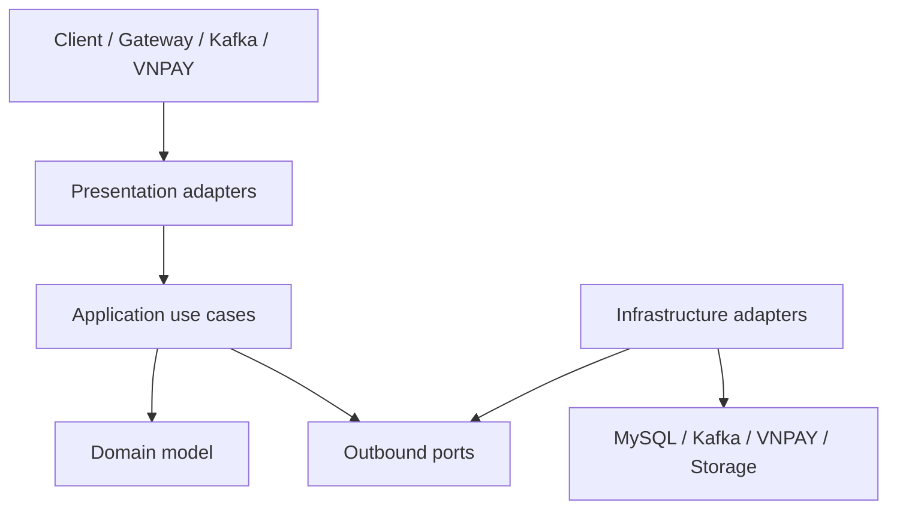
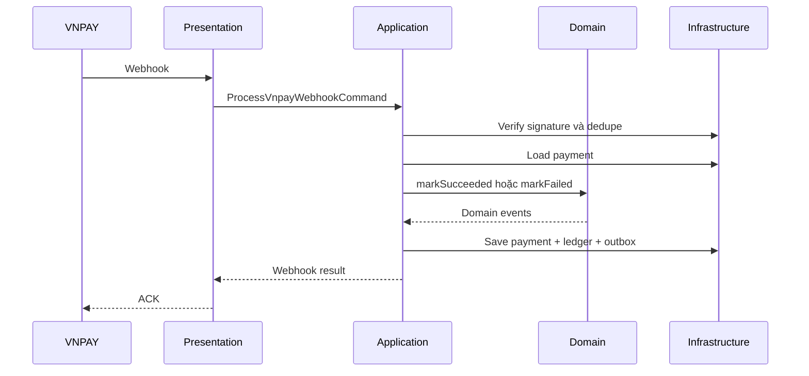

# Kế hoạch kiến trúc và triển khai Payment-Wallet Service

> **Tech stack:** Java 25 · Spring Boot · MySQL 8.4 · Kafka · VNPAY Sandbox · COD  
> **Kiến trúc:** Domain-Driven Design (DDD) kết hợp Hexagonal Architecture  
> **Quyết định phạm vi:** Giữ nguyên Payment-Wallet LLD, API và Webhook VNPAY; hoàn thiện thiết kế database và tổ chức source code.

## 1. Kiến trúc tổng thể

`payment-wallet-service` là một Spring Boot microservice triển khai theo DDD kết hợp Hexagonal Architecture, tách rõ bốn lớp `Presentation`, `Application`, `Domain` và `Infrastructure`.



Quy tắc phụ thuộc:

```text
Presentation   → Application
Application    → Domain
Infrastructure → Application ports + Domain
Domain         → Không phụ thuộc lớp nào
```

Domain tuyệt đối không được phụ thuộc trực tiếp vào:

```text
Spring
JPA/Hibernate
Kafka
Jackson
VNPAY SDK
MySQL
HTTP client
```

## 2. Cấu trúc source code đề xuất

Đối với project nhóm, nên sử dụng một Maven module Spring Boot, phân tách bằng package và kiểm soát bằng ArchUnit. Chưa cần chia thành nhiều Maven module vì sẽ làm build và quản lý dependency phức tạp hơn.

```text
src/main/java/com/taca/paymentwallet
├── PaymentWalletApplication.java
│
├── presentation
│   ├── rest
│   │   ├── payment
│   │   ├── wallet
│   │   ├── payout
│   │   ├── refund
│   │   ├── settlement
│   │   └── admin
│   ├── webhook
│   │   └── VnpayWebhookController.java
│   ├── messaging
│   │   ├── OrderEventConsumer.java
│   │   ├── ShipmentEventConsumer.java
│   │   └── ShopEventConsumer.java
│   ├── dto
│   ├── mapper
│   └── exception
│
├── application
│   ├── port
│   │   ├── in
│   │   │   ├── CreatePaymentUseCase.java
│   │   │   ├── GetPaymentUseCase.java
│   │   │   ├── ProcessVnpayWebhookUseCase.java
│   │   │   ├── RequestRefundUseCase.java
│   │   │   ├── RequestPayoutUseCase.java
│   │   │   ├── GetWalletUseCase.java
│   │   │   └── RunSettlementUseCase.java
│   │   └── out
│   │       ├── PaymentRepositoryPort.java
│   │       ├── WalletRepositoryPort.java
│   │       ├── LedgerRepositoryPort.java
│   │       ├── RefundRepositoryPort.java
│   │       ├── PayoutRepositoryPort.java
│   │       ├── OrderSnapshotPort.java
│   │       ├── VnpayGatewayPort.java
│   │       ├── BankTransferPort.java
│   │       ├── OutboxPort.java
│   │       ├── InboxPort.java
│   │       ├── IdempotencyPort.java
│   │       ├── TransactionPort.java
│   │       ├── ClockPort.java
│   │       └── IdGeneratorPort.java
│   ├── command
│   ├── query
│   ├── service
│   ├── result
│   └── mapper
│
├── domain
│   ├── payment
│   │   ├── Payment.java
│   │   ├── PaymentAttempt.java
│   │   ├── PaymentAllocation.java
│   │   ├── PaymentStatus.java
│   │   └── PaymentMethod.java
│   ├── wallet
│   │   ├── Wallet.java
│   │   ├── LedgerAccount.java
│   │   ├── LedgerPosting.java
│   │   └── LedgerEntry.java
│   ├── refund
│   │   ├── Refund.java
│   │   └── RefundStatus.java
│   ├── payout
│   │   ├── Payout.java
│   │   └── PayoutStatus.java
│   ├── settlement
│   │   ├── SettlementBatch.java
│   │   └── SettlementBatchItem.java
│   ├── finance
│   │   ├── FeeConfig.java
│   │   ├── TaxConfig.java
│   │   └── AllocationCalculator.java
│   ├── event
│   ├── exception
│   └── valueobject
│       ├── Money.java
│       ├── RateBps.java
│       ├── PaymentId.java
│       ├── OrderId.java
│       ├── ShopId.java
│       ├── CheckoutGroupId.java
│       └── IdempotencyKey.java
│
└── infrastructure
    ├── persistence
    │   ├── entity
    │   ├── repository
    │   ├── adapter
    │   └── mapper
    ├── messaging
    │   ├── kafka
    │   ├── outbox
    │   └── inbox
    ├── provider
    │   ├── vnpay
    │   └── bank
    ├── storage
    ├── security
    ├── transaction
    ├── observability
    └── config
```

## 3. Trách nhiệm từng lớp

### 3.1 Presentation

Presentation chỉ thực hiện:

- Nhận HTTP request, webhook hoặc Kafka event.
- Validate định dạng cơ bản.
- Chuyển request thành command/query.
- Gọi inbound port.
- Chuyển kết quả thành response.
- Chuyển exception thành HTTP error.

Presentation không được:

- Truy cập repository trực tiếp.
- Tính commission hoặc tax.
- Cập nhật payment state.
- Ghi ledger.
- Gọi trực tiếp VNPAY hoặc Kafka producer.

Ví dụ:

```java
@RestController
@RequiredArgsConstructor
class PaymentController {

    private final CreatePaymentUseCase createPaymentUseCase;

    @PostMapping("/api/v1/payments")
    PaymentResponse create(
            @RequestHeader("Idempotency-Key") String key,
            @Valid @RequestBody CreatePaymentRequest request) {

        CreatePaymentCommand command =
                PaymentPresentationMapper.toCommand(request, key);

        return PaymentPresentationMapper.toResponse(
                createPaymentUseCase.execute(command)
        );
    }
}
```

### 3.2 Application

Application điều phối use case:

- Kiểm tra idempotency.
- Load aggregate thông qua repository port.
- Gọi Domain xử lý nghiệp vụ.
- Gọi outbound port.
- Điều phối transaction.
- Ghi outbox.
- Trả kết quả cho Presentation.

Application không chứa công thức nghiệp vụ tài chính phức tạp. Công thức commission, tax, refund và state transition phải nằm trong Domain.

Ví dụ:

```java
public interface CreatePaymentUseCase {
    CreatePaymentResult execute(CreatePaymentCommand command);
}
```

```java
public final class CreatePaymentService
        implements CreatePaymentUseCase {

    private final PaymentRepositoryPort paymentRepository;
    private final OrderSnapshotPort orderSnapshotPort;
    private final IdempotencyPort idempotencyPort;
    private final VnpayGatewayPort vnpayGatewayPort;
    private final OutboxPort outboxPort;
    private final TransactionPort transactionPort;

    @Override
    public CreatePaymentResult execute(CreatePaymentCommand command) {
        // Điều phối use case, không chứa công thức tài chính.
        throw new UnsupportedOperationException("Not implemented");
    }
}
```

### 3.3 Domain

Domain chứa toàn bộ nghiệp vụ cốt lõi:

- Payment state machine.
- Kiểm tra payment/refund transition.
- Tính commission, tax và seller net.
- Đảm bảo refund không vượt captured amount.
- Tạo ledger posting cân bằng.
- Kiểm tra payout.
- Settlement pending sang available.
- Phát domain event.

Ví dụ:

```java
public class Payment {

    private PaymentStatus status;
    private Money capturedAmount;
    private Money refundedAmount;

    public void markSucceeded(ProviderReference reference) {
        if (status != PaymentStatus.PENDING) {
            throw new InvalidPaymentStateException(status);
        }

        this.status = PaymentStatus.SUCCESS;
        registerEvent(new PaymentSucceededEvent(id, reference));
    }

    public void reserveRefund(Money amount) {
        if (!amount.isPositive()) {
            throw new InvalidRefundAmountException();
        }

        if (refundedAmount.add(amount).isGreaterThan(capturedAmount)) {
            throw new RefundLimitExceededException();
        }
    }
}
```

Aggregate không cho phép lớp ngoài gọi setter để thay đổi trạng thái tùy ý.

### 3.4 Infrastructure

Infrastructure triển khai các outbound port:

- JPA/MySQL repository.
- Kafka producer và consumer configuration.
- Outbox publisher.
- Inbox deduplication.
- VNPAY signature, payment URL và webhook adapter.
- Bank transfer adapter.
- Object storage cho export.
- Spring transaction.
- Security, tracing và metrics.

Ví dụ:

```java
@Component
@RequiredArgsConstructor
class JpaPaymentRepositoryAdapter
        implements PaymentRepositoryPort {

    private final SpringDataPaymentRepository repository;
    private final PaymentPersistenceMapper mapper;

    @Override
    public Optional<Payment> findById(PaymentId id) {
        return repository.findById(id.value())
                .map(mapper::toDomain);
    }
}
```

JPA entity phải tách khỏi Domain entity:

| Domain aggregate | Persistence entity |
|---|---|
| `Payment` | `PaymentJpaEntity` |
| Không có `@Entity` | Có `@Entity` |
| Có business method | Chỉ phục vụ persistence |
| Không phụ thuộc JPA | Phụ thuộc JPA/Hibernate |

## 4. Các aggregate chính

| Aggregate | Trách nhiệm |
|---|---|
| `Payment` | Quản lý logical payment và state transition. |
| `PaymentAttempt` | Quản lý một lần tạo payment URL/giao dịch với provider. |
| `LedgerPosting` | Bảo đảm tổng debit bằng tổng credit. |
| `Wallet` | Quản lý trạng thái và balance projection. |
| `Refund` | Quản lý refund lifecycle và giới hạn hoàn tiền. |
| `Payout` | Reserve tiền, chuyển khoản và reversal khi thất bại. |
| `SettlementBatch` | Chuyển seller pending sang available. |
| `FeeConfig` | Quản lý version commission. |
| `TaxConfig` | Quản lý version thuế. |

Không nên tạo một aggregate khổng lồ chứa payment, wallet, refund, payout và settlement cùng lúc.

## 5. Value Object cần có

### 5.1 `Money`

```java
public record Money(long amount, Currency currency) {

    public Money {
        if (amount < 0) {
            throw new IllegalArgumentException("Amount must not be negative");
        }
    }

    public Money add(Money other) {
        requireSameCurrency(other);
        return new Money(Math.addExact(amount, other.amount), currency);
    }
}
```

`Money` giúp:

- Không cộng nhầm currency.
- Không dùng `double`.
- Kiểm tra overflow.
- Gom logic so sánh tiền về một nơi.

### 5.2 `RateBps`

```java
public record RateBps(int value) {

    public RateBps {
        if (value < 0 || value > 10_000) {
            throw new IllegalArgumentException("Invalid basis points");
        }
    }
}
```

```text
700 bps   = 7%
10000 bps = 100%
```

Các ID cũng nên là value object để không truyền nhầm `orderId`, `shopId` và `paymentId`.

## 6. Các port chính

### 6.1 Inbound port

Được gọi từ controller hoặc message consumer:

```text
CreatePaymentUseCase
GetPaymentUseCase
ProcessVnpayWebhookUseCase
RequestRefundUseCase
GetRefundUseCase
GetWalletUseCase
GetSellerRevenueUseCase
RequestPayoutUseCase
GetPayoutUseCase
RunSettlementUseCase
ConfigureFeeUseCase
ConfigureTaxUseCase
ReconcilePaymentUseCase
```

### 6.2 Outbound port

Được Application sử dụng:

```text
PaymentRepositoryPort
WalletRepositoryPort
LedgerRepositoryPort
RefundRepositoryPort
PayoutRepositoryPort
SettlementRepositoryPort
FeeConfigRepositoryPort
TaxConfigRepositoryPort

OrderSnapshotPort
VnpayGatewayPort
VnpaySignaturePort
BankTransferPort
FileStoragePort

OutboxPort
InboxPort
IdempotencyPort
AuditLogPort
TransactionPort

ClockPort
IdGeneratorPort
```

`ClockPort` và `IdGeneratorPort` giúp test thời gian hết hạn và UUID mà không phụ thuộc thời gian thật.

## 7. Xử lý Webhook VNPAY

Giữ nguyên API:

```http
POST /api/v1/payments/webhook
```

Luồng xử lý:



Transaction bắt buộc bao gồm:

```text
Update payment
+ Insert payment_event
+ Insert allocations
+ Insert ledger posting
+ Update wallet projection
+ Insert outbox_event
```

Nếu một thao tác thất bại thì rollback toàn bộ.

Xử lý duplicate webhook:

```text
provider_event_id đã tồn tại
→ không gọi domain transition
→ không ghi ledger
→ trả ACK thành công
```

## 8. Transaction và xử lý external API

### 8.1 Payment webhook

Có thể xử lý trong một DB transaction vì không gọi external API sau khi nhận kết quả.

### 8.2 Payout

Không giữ DB transaction trong lúc gọi ngân hàng:

```text
Request payout
→ reserve/debit available balance
→ tạo payout REQUESTED
→ ghi outbox payout.requested
→ commit

Worker nhận event
→ gọi BankTransferPort
→ cập nhật SUCCESS
hoặc
→ cập nhật FAILED + tạo ledger reversal
```

### 8.3 Refund

Áp dụng tương tự:

```text
Tạo refund REQUESTED
→ reserve refundable amount
→ commit
→ worker gọi VNPAY refund
→ SUCCESS: reverse allocation và ledger
→ FAILED: giải phóng refund reservation
```

Cách này tránh giữ connection và lock DB khi VNPAY hoặc ngân hàng phản hồi chậm.

## 9. Kế hoạch triển khai

### Giai đoạn 1 — Chốt contract và database

Công việc:

- Giữ nguyên LLD và API.
- Cập nhật `payment-wallet-db.md`.
- Chốt một payment cho một `checkout_group`.
- Bổ sung `PENDING_COD`.
- Hoàn thiện ledger account–posting–entry.
- Bổ sung payment orders, refund allocations, settlement lines và inbox.
- Chốt fee/tax v1 chỉ dùng `PLATFORM`.

Kết quả:

- ERD hoàn chỉnh.
- Data dictionary.
- Danh sách constraint/index.
- Không còn mâu thuẫn enum và quan hệ.

### Giai đoạn 2 — Khởi tạo project và architecture guard

Công việc:

- Tạo Spring Boot project.
- Tạo bốn package chính.
- Thêm common exception/result.
- Tạo ArchUnit test.
- Cấu hình Checkstyle/Spotless.
- Tạo profile `local`, `test`, `prod`.

Architecture test cần ngăn:

```text
Domain phụ thuộc Spring/JPA
Presentation gọi Infrastructure
Controller gọi JpaRepository
Application phụ thuộc REST DTO
Domain sử dụng persistence entity
```

### Giai đoạn 3 — Xây dựng Domain

Thứ tự:

1. Value objects.
2. Payment aggregate và state machine.
3. Allocation calculator.
4. Ledger posting.
5. Wallet.
6. Refund.
7. Payout.
8. Settlement.
9. Domain events.

Mỗi invariant phải có unit test trước khi sang Infrastructure.

### Giai đoạn 4 — Application use cases

Triển khai:

- Command/query.
- Inbound ports.
- Outbound ports.
- Application services.
- Idempotency orchestration.
- Transaction orchestration.
- Domain event → integration event mapping.

Ở giai đoạn này sử dụng fake/in-memory port, chưa cần MySQL hoặc Kafka.

### Giai đoạn 5 — Persistence Infrastructure

Triển khai:

- Flyway migration.
- JPA entities.
- Spring Data repositories.
- Persistence mappers.
- Repository adapters.
- Transaction adapter.
- MySQL Testcontainers integration test.

Thứ tự migration đề xuất:

```text
V001__create_payments.sql
V002__create_payment_orders_and_attempts.sql
V003__create_payment_events.sql
V004__create_wallets_and_ledger.sql
V005__create_payment_allocations.sql
V006__create_refunds_and_payouts.sql
V007__create_fee_and_tax_configs.sql
V008__create_settlements.sql
V009__create_inbox_outbox.sql
V010__create_audit_and_indexes.sql
```

### Giai đoạn 6 — VNPAY và Webhook

Triển khai:

- `VnpayGatewayAdapter`.
- Signature verification.
- Tạo payment URL.
- Webhook normalization.
- Provider status mapping.
- Webhook deduplication.
- Amount/order/payment matching.
- VNPAY sandbox configuration.

Test bắt buộc:

```text
Valid success webhook
Invalid signature
Amount mismatch
Unknown payment
Duplicate webhook
Out-of-order webhook
Expired payment
Webhook transaction rollback
```

### Giai đoạn 7 — Kafka inbox/outbox

Triển khai:

- Outbox publisher.
- Retry và DLQ.
- Inbox dedupe.
- Order event consumer.
- Shipment event consumer.
- Shop KYC/status consumer.
- Trace header propagation.

Test:

```text
Duplicate shipment.delivered không double credit
Duplicate order.cancelled không double refund
Kafka publish lỗi không mất outbox event
Consumer lỗi có thể retry an toàn
```

### Giai đoạn 8 — Wallet, payout, refund và settlement

Thứ tự:

1. Payment allocation.
2. Seller pending balance.
3. Settlement pending → available.
4. Payout reserve.
5. Payout success/failure reversal.
6. Refund reservation.
7. Refund success reversal.
8. Revenue report.

### Giai đoạn 9 — Presentation và bảo mật

Triển khai:

- REST controller theo API đã chốt.
- Global exception handler.
- Request validation.
- JWT scope.
- `FINANCE_OPS`.
- Step-up 2FA validation.
- Webhook security.
- Request ID và trace ID.
- Rate limiting cho webhook và payout.

### Giai đoạn 10 — Hoàn thiện vận hành

Bổ sung:

- Structured JSON logging.
- Prometheus/OpenTelemetry metrics.
- Liveness/readiness.
- Dockerfile.
- Docker Compose cho local.
- CI build/test.
- Swagger/OpenAPI.
- Runbook cho webhook, reconciliation và DLQ.
- Seed data local/test.

## 10. Chiến lược kiểm thử

| Loại test | Phạm vi |
|---|---|
| Domain unit test | State machine, Money, allocation, ledger và refund. |
| Application test | Use case với fake ports. |
| Architecture test | Kiểm tra hướng dependency. |
| Persistence integration test | JPA, migration và concurrency với MySQL. |
| Adapter test | VNPAY signature và Kafka serialization. |
| Contract test | API request/response và event schema. |
| End-to-end test | Checkout → payment → webhook → wallet. |
| Concurrency test | Duplicate webhook, refund và payout đồng thời. |

Tỷ lệ ưu tiên:

```text
Domain/Application tests: nhiều nhất
Adapter integration tests: vừa đủ
End-to-end tests: ít nhưng bao phủ luồng quan trọng
```

## 11. Definition of Done

Một chức năng chỉ được xem là hoàn thành khi:

- Controller chỉ gọi inbound port.
- Use case không import Infrastructure.
- Domain không có annotation Spring/JPA.
- External system được gọi qua outbound port.
- Có transaction boundary rõ ràng.
- Có idempotency cho mutation tài chính.
- Có unit test cho domain invariant.
- Có integration test cho persistence.
- Có log, metric và trace ID.
- Không lưu hoặc log secret/signature thô.
- Duplicate event không tạo thêm ledger entry.
- Mọi ledger posting có tổng debit bằng tổng credit.
- DB migration chạy được từ database rỗng.

## 12. Kết luận

Hướng triển khai phù hợp nhất là giữ một deployable Spring Boot duy nhất, tổ chức nội bộ theo DDD và Hexagonal Architecture, phát triển từng use case theo lát cắt dọc nhưng vẫn bảo đảm ranh giới `Presentation – Application – Domain – Infrastructure`.

Các hệ thống bên ngoài như MySQL, Kafka, VNPAY, ngân hàng và object storage chỉ được truy cập thông qua outbound port. Cách tổ chức này giúp service dễ kiểm thử, dễ bảo trì và có thể thay đổi adapter kỹ thuật mà không ảnh hưởng nghiệp vụ cốt lõi.
